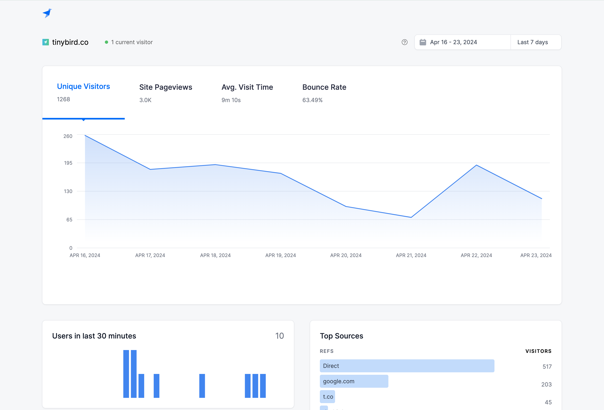

# Front-end application

This folder contains all of the code to build the frontend of this demo.



## Deploying the app

Run it locally with:

```sh
npm install & npm run dev
```

Or deploy it to Vercel:

[](https://vercel.com/new/clone?repository-url=https%3A%2F%2Fgithub.com%2Ftinybirdco%2Fdemo-user-facing-web-analytics%2Ftree%2Fmain%2Fapp&env=NEXT_PUBLIC_TINYBIRD_AUTH_TOKEN,NEXT_PUBLIC_TINYBIRD_HOST,NEXT_PUBLIC_BASE_URL&envDescription=Tinybird%20configuration&project-name=user-facing-web-analytics&repository-name=user-facing-web-analytics)

You'll need to enter your [Tinybird Token](https://www.tinybird.co/docs/concepts/auth-tokens) and Tinybird Host (e.g. https://ui.tinybird.co).
